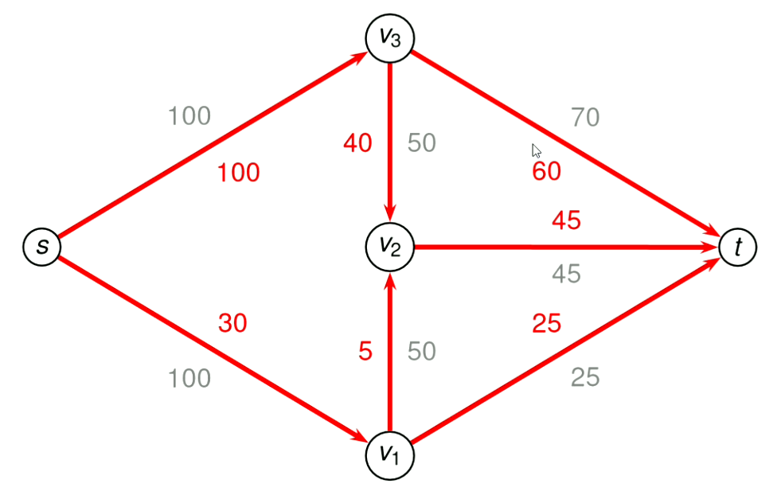

# Network Flow

## The Problem

- Flow from a source to a sink node in a directed graph
- E.g
  - A server will have to transmit information somehow to a client
  - Or water pipes
- The graphs have both a capacity unit measure as well as a current usage unit measure
  - Black represents capacity and red represents current load
- Many different combinations of how things can flow through the network

### Maximum Flow In A Network

- Bottlenecks happen
- General method for figuring out the maximum flow capacity

## Setting Up The Problem

- Let `G = (V, E)` be a directed graph
- Edge flow:
  - Have a flow over them, represented as: `f(e)` for a given edge `e`
- Edge capacity:
  - Have a maximum flow capacity, `c(e)`
  - Flow cannot exceed capacity, `f(e) <= c(e)`
  - Going to assume it's an integer
- Flow must be preserved, so the inputs into a node must add up to the outputs of the node
- With bigger networks, there lots of paths

### Simple Example


- Maximum flow on the above network would be 140 because the sink can only handle `70 + 45 + 25 = 140`

- To figure out the maximum capacity of this graph, start filling it out:



#### Untapped Capacity

- Looking for an improved flow
  - Total flow is 130 currently
  - Network can support a flow of 140
  - Push 10 more down the path `(s, V1, V2, V3, t)`
  - Redirecting 10 units of flow from `(V3, V2)` to `(V3, t)`
- Potential for redirection of flow captured in the residual graph

## Residual Graphs

- Combines the 2 concepts of capacity vs flow
- Residual graphs will show the residual forwards capacity
  - So in the solution image, the edge `(s, V1)` has 70 units left over
  - This can be shown as another link with 70 units on it with forwards edge
- Will wind up with something like this:


- The residual graph will be on top of the original network
- There's the actual flow as well in the network
- This is shown with backwards edges


- Then strip away the underlying flow graph to then just get the residual flow arrows and the actual flow arrows


- Given some directed graph `G = (V, E)` and some flow `f` for `G`
  - The residual graph of `G` and `f` will be denoted by `G`<sub>`f`</sub>
- Forward arrows
  - The remaining capacity of the edge
  - Solid lines or black coloured lines
  - AKA `c(e) - f(e)`
- Backward arrows
  - The current usage
  - Show capacity to redirect flow
  - Dashed lines or red coloured lines
  - Reverse direction of edge from original graph
  - AKA the `f(e)` values
- The point is to optimise the flow of the original graph

### Bottleneck Edges

- A path's bottleneck edge is the edge with lowest capacity
- Defines the maximum flow for a path
- Flow of the network can be augmented by capacity of bottleneck edge

### Augmenting Flow


- Not an actual flow network, it's a path through a residual flow network
  - Combination of forwards and backwards edges
- In this case, it's the only path in the network from source to sink
- Bottleneck is the edge `(V3, t)` with a value of 10
- Possible augmentation:
  - Identified a path from `s` to `t` in residual graph: `(s, V1, V2, V3, t)`
  - Bottleneck edge has residual capacity of 10
  - Can add 10 units of additional flow to this network
- How to augment:
  - Increment flow of each forward edge on path by 10
    - Corresponds to adding new flow along an under-capacity edge
  - Decrement flow of edges in `G` that give rise to backward edge on path by 10
    - Corresponds to redirecting existing flow elsewhere


- Then completing the maths ...


- Now we have 140 total flow which is the maximum for the network
- If there is no path in the network, then the solution is optimal
- If there are multiple however, then you need to do multiple iterations of the algorithm

### Ford-Fulkerson Algorithm

- Pretty much the process described above

```javascript
// G is the graph, s is the source, t is the sink and c is the capacities of all edges
MaximumFlow(G, s, t, c):
  let f(e) = 0 for al e in E
  let Gf be the residual graph built from G and f
  while there is a path from s to t in Gf
    let p be a simple path from s to t in Gf
    let x be the residual capacity of the bottleneck edge of p
    f ⟵ augment(G, f, p, x)
    let Gf be the residual graph built from G and f
  return f
```

#### Implementation

- Finding a `s` to `t` path in the residual graph
  - Perform a DFS from `s`
  - Takes `O(n + m)` time
  - `O(m)` since we assume all vertices have at least one incident edge
- Iterations of the while loop?
  - Flow (net flow) is increased by at least one on every iteration
    - Assumes edge capacities are integers
  - Flow is a measure of progress
  - Number of iterations bounded by upper bound on flow, `C`
  - Overall running time is `O(Cm)`

## Cuts In A Network

- Basically cut the network in half
- Mathsy notation:
- Let G = (V, E) be some network
- (A, B) is a cut in the network if:
  - s is in A
  - t is in B
  - A union B = V and A intersection B = {}
  - In other words (A, B) is a partition of the set V
- Many different possible cuts
- The cut capacity is the total capacity of the edges that were removed
- The cut capacity is useful because the minimum cut capacity that can be found is the maximum flow that the sink can handle

## Bipartite Matching As Network Flow

- May have a problem like the bipartite graph from earlier in the year
- For the residual graph, there's a residual forwards capacity of 1 and backwards actual flow of 0, aka (1, 0)
- When augmenting a single path, turn all the edges (0, 1)
- Then find another simple path, however can't go down the other paths
- Basically bipartite matching for it
